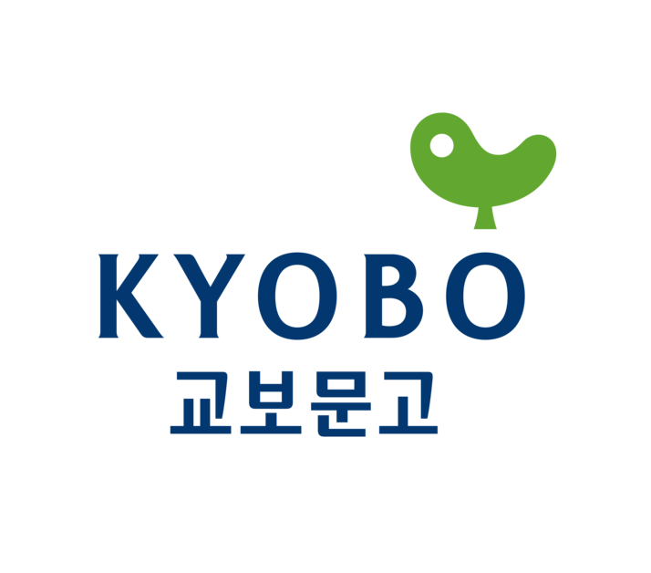

# DA28_pj01_4
# 4팀: 교보문고 연간 베스트 데이터 분석하기
팀원: 김영광, 김지수, 이우진

---
1. 목표
- python의 BeautifulSoup, Selenium 모듈을 사용해 웹스크래핑으로 정보 가져오기

- mysql을 활용해 받아온 정보를 DataFrame으로 저장하고 다루기

- 시각화를 통해 결론 도출하기

---
2. 교보문고의 연간 베스트 5개년 데이터로 살펴 볼 질문
<https://product.kyobobook.co.kr/bestseller/total?period=004#?page=1&per=20&period=004&ymw=&bsslBksClstCode=A>

- 5개년 간 상위를 차지한 장르는?

- 위의 장르가 5개년 간 순위 리스트에서 차지한 비율은?

- 각 장르별 많이 달린 코멘트의 유형은? (ex> "고마워요", "유익해요" etc.)

- 도서별 장당 가격과, 장당 가격이 전체 순위에 미치는 영향은? [장르별 비교]
